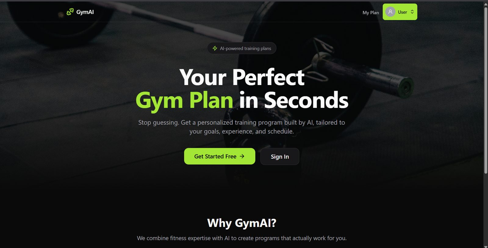
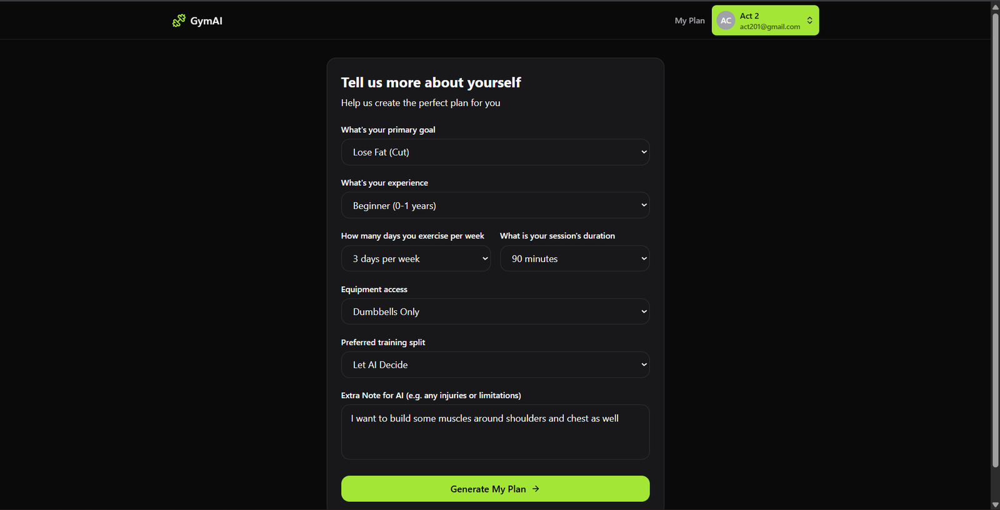
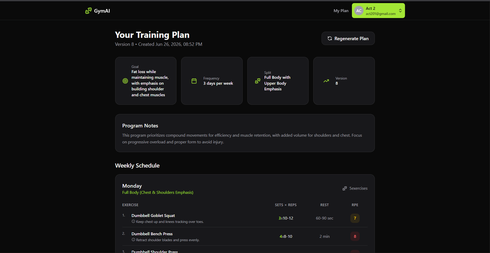
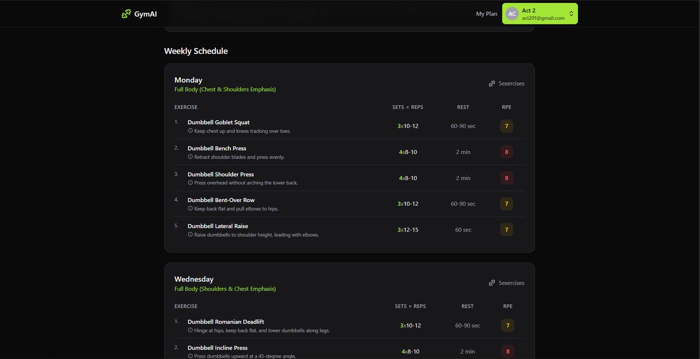

# 🏋️ GymAI — AI-Powered Training Plan Generator

GymAI is a full-stack web app that generates **personalized, structured gym training plans** using a large language model. Users complete a short onboarding questionnaire (goal, experience, schedule, equipment, injuries), and the app produces a complete weekly workout plan — exercises, sets, reps, rest, and RPE — tailored to their profile.

> Built to explore how an LLM can be used as a structured data engine (not just a chatbot) — the model is prompted to return strict JSON, which is then validated, normalized, and persisted to a relational database.

🎥 **Demo video:** [Watch on YouTube](#) *(coming soon)*

### 📸 Screenshots

<p align="center">
  
  <br/>
  <sub>Landing page</sub>
</p>

<table>
  <tr>
    <td></td>
    <td></td>
  </tr>
  <tr>
    <td align="center"><sub>Onboarding questionnaire</sub></td>
    <td align="center"><sub>Generated plan overview</sub></td>
  </tr>
</table>

<p align="center">
  
  <br/>
  <sub>AI-generated weekly schedule with sets, reps, rest, and RPE</sub>
</p>

---

## ✨ Features

- **AI-generated training plans** — describes goal, experience, equipment, and schedule once; receives a structured multi-day program in seconds
- **Versioned plans** — every regeneration is saved as a new version, so plan history isn't lost
- **Profile-aware prompting** — injuries/limitations are factored directly into what the AI is asked to avoid
- **Authentication** — sign up, sign in, and account management handled via Neon Auth
- **Persistent storage** — user profiles and generated plans stored in Postgres (Neon) via Prisma ORM
- **Type-safe end to end** — TypeScript across both the React frontend and Express backend

---

## 🛠️ Tech Stack

| Layer | Technology |
|---|---|
| Frontend | React 19, TypeScript, Vite, React Router, Tailwind CSS |
| Backend | Node.js, Express 5, TypeScript |
| Database | Neon (Serverless Postgres), Prisma ORM |
| Auth | Neon Auth |
| AI / LLM | NVIDIA NIM (`mistralai/mistral-medium-3.5`), via OpenAI-compatible API |

---

## 🧠 How the AI Generation Works

1. User completes the onboarding form (goal, experience, days/week, session length, equipment, preferred split, injuries).
2. The backend builds a **structured prompt** describing the user's profile and the exact JSON schema the response must follow.
3. The prompt is sent to NVIDIA NIM's chat completions endpoint (Mistral Medium 3.5), with the system role constrained to return **JSON only** — no markdown, no commentary.
4. The response is parsed, defensively normalized (missing fields fall back to sane defaults), and saved to the database as a new plan version.
5. The frontend renders the plan as a day-by-day schedule with sets, reps, rest, and RPE-based intensity coloring.

---

## 📂 Project Structure

```
React-Typescript-AI-Gym-Planner/
├── src/                      # Frontend (React + TypeScript)
│   ├── components/
│   │   ├── layout/            # Navbar
│   │   ├── plan/              # PlanDisplay (renders weekly schedule)
│   │   └── ui/                # Reusable primitives (Button, Card, Input, Select, Textarea)
│   ├── context/               # AuthContext (user session, profile, plan state)
│   ├── lib/                   # API client, auth client
│   ├── pages/                 # Home, Onboarding, Profile, Auth, Account, NotFound
│   └── types/                 # Shared frontend TypeScript types
│
├── server/                    # Backend (Express + TypeScript)
│   ├── prisma/                 # Schema + migrations
│   └── src/
│       ├── lib/                # Prisma client, AI generation logic
│       ├── routes/             # /api/profile, /api/plan
│       └── types/              # Shared backend TypeScript types
│
└── public/                    # Static assets
```

---

## 🚀 Getting Started

### Prerequisites
- Node.js 18+
- A [Neon](https://neon.tech) Postgres database
- An [NVIDIA NIM](https://build.nvidia.com) API key

### 1. Clone the repo
```bash
git clone https://github.com/Aryan-Gupta2002/React-Typescript-AI-Gym-Planner.git
cd React-Typescript-AI-Gym-Planner
```

### 2. Backend setup
```bash
cd server
npm install
```

Create a `server/.env` file:
```env
DATABASE_URL=your_neon_postgres_connection_string
NVIDIA_API_KEY=your_nvidia_nim_api_key
NVIDIA_BASE_URL=https://integrate.api.nvidia.com/v1
NVIDIA_MODEL_NAME=mistralai/mistral-medium-3.5
PORT=3001
```

Run database migrations:
```bash
npx prisma migrate deploy
```

Start the backend:
```bash
npm run dev:server
```

### 3. Frontend setup
```bash
cd ..  # back to project root
npm install
```

Create a `.env` file in the project root:
```env
VITE_API_URL=http://localhost:3001
VITE_NEON_AUTH_URL=your_neon_auth_url
```

Start the frontend:
```bash
npm run dev
```

The app will be running at `http://localhost:5173`.

---

## 🗺️ Roadmap / Known Limitations

This project is functional end-to-end, but there are a few areas I'm actively aware of and plan to improve:

- **No automated tests yet** — manual testing only so far; unit/integration tests are a planned next step.
- **No deployment** — currently runs locally; deploying frontend (Vercel) + backend (Render/Railway) is planned.
- **Limited LLM output validation** — malformed JSON from the model is caught, but there's no retry/repair logic yet if the model's response doesn't perfectly match the schema.
- **No exercise database/validation** — exercise names are fully generated by the LLM rather than checked against a curated list, so occasional naming inconsistencies are possible.
- **Single LLM provider** — no fallback if NVIDIA NIM is unavailable.

---

## 📄 License

This project is for educational/portfolio purposes.

---

## 👤 Author

**Aryan Gupta**
GitHub: [@Aryan-Gupta2002](https://github.com/Aryan-Gupta2002)
